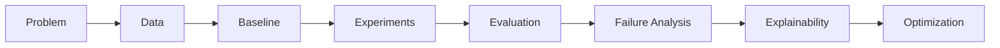

<div align="center">


<a href="https://git.io/typing-svg">

</a>

<br/>

<a href="https://www.linkedin.com/in/mdsifatullahsheikh">

</a>

<a href="https://scholar.google.com/citations?view_op=list_works&hl=en&user=7m3g1cEAAAAJ">

</a>

<a href="mailto:mdsifatullahsheikh@gmail.com">

</a>

<a href="https://github.com/SifatSwapnil2022?tab=repositories">

</a>

</div>

---

## `01` — About

```yaml
name: Md Sifatullah Sheikh
role: Machine Learning Engineer
location: Dhaka, Bangladesh

education:
  degree: B.Sc. in Computer Science & Engineering
  university: East West University
  major: Data Science & Intelligent Systems

interests:
  - Machine Learning
  - Computer Vision
  - Deep Learning
  - Multimodal Learning
  - Explainable AI
  - Robotics & Intelligent Systems
```

I am a Computer Science & Engineering graduate working in **machine learning engineering and applied AI research**.

My current work involves data preprocessing, experimentation, model development, validation, performance analysis, and optimization. My research interests are mainly around **computer vision, deep learning, multimodal systems, and explainable AI**.

---

## `02` — Current Focus

<table>
<tr>

<td width="50%" valign="top">

### ⚙️ Engineering

```text
Data Preparation
      ↓
Feature Engineering
      ↓
Model Development
      ↓
Validation
      ↓
Performance Analysis
      ↓
Optimization
```

</td>

<td width="50%" valign="top">

### 🔬 Research

```text
Computer Vision
      │
      ├── Deep Learning
      ├── Vision Transformers
      ├── Multimodal Learning
      └── Explainable AI
```

</td>

</tr>
</table>

---

## `03` — Research

<table>
<tr>

<td width="50%" valign="top">

### 🧠 DeFaX

**Cross-Attention Fusion for Deepfake Detection**

Research on detecting AI-generated and manipulated facial images using deep-learning models with visual explainability.

`CNN` `Vision Transformer` `Cross-Attention` `Grad-CAM` `LIME`

<br/>

**Published in IEEE Access**

<a href="https://ieeexplore.ieee.org/abstract/document/11303744">

</a>

</td>

<td width="50%" valign="top">

### 🌿 Medicinal Plant Vision

**Medicinal Plant Recognition & Explainability**

Research using deep-learning and transformer-based models for medicinal plant identification from leaf images.

The work also includes a Bangladesh-focused medicinal plant image dataset.

`Computer Vision` `CNN` `ViT` `Dataset` `XAI`

<br/>

<a href="https://doi.org/10.17632/9tdc9gbtgb.2">

</a>

</td>

</tr>
</table>

<br/>

<details>
<summary><b>Research interests</b></summary>

<br/>

| Area                   | Interest                                    |
| ---------------------- | ------------------------------------------- |
| Computer Vision        | Image and video understanding               |
| Deep Learning          | Neural networks and representation learning |
| Multimodal Learning    | Combining visual and language information   |
| Explainable AI         | Understanding model predictions             |
| Efficient ML           | Reducing computational requirements         |
| Robotics / Embodied AI | Perception and intelligent decision-making  |

</details>

<br/>

<div align="center">

<a href="https://scholar.google.com/citations?view_op=list_works&hl=en&user=7m3g1cEAAAAJ">

</a>

</div>

---

## `04` — Selected Projects

<table>

<tr>

<td width="33%" valign="top">

### 🧠 DeFaX

**Deepfake Detection**

Cross-attention based deepfake detection framework with explainability support.

**Tools**

`PyTorch`
`CNN`
`ViT`
`Grad-CAM`
`LIME`

</td>

<td width="33%" valign="top">

### 🌿 MediLeafNET

**Medicinal Plant Recognition**

Computer-vision research for identifying medicinal plants using deep-learning and transformer models.

**Tools**

`CNN`
`Vision Transformer`
`BERT`
`Explainable AI`

</td>

<td width="33%" valign="top">

### 🩺 SkinCare AI

**Computer Vision + LLM**

Image-analysis system combining detection, classification, and an LLM-assisted recommendation component.

**Tools**

`YOLOv8`
`ResNet50`
`EfficientNet`
`FastAPI`

</td>

</tr>

</table>

<br/>

<div align="center">

<a href="https://github.com/SifatSwapnil2022?tab=repositories">

</a>

</div>

---

## `05` — Tech Stack

<div align="center">


</div>

<br/>

<table>

<tr>

<td width="25%" valign="top">

### ML / Vision

* PyTorch
* TensorFlow
* Keras
* scikit-learn
* OpenCV
* YOLO
* Transformers

</td>

<td width="25%" valign="top">

### Data

* NumPy
* Pandas
* Matplotlib
* Jupyter
* Data Mining
* Feature Engineering

</td>

<td width="25%" valign="top">

### Engineering

* FastAPI
* REST APIs
* React
* Docker
* Git
* GitHub

</td>

<td width="25%" valign="top">

### Languages

* Python
* C
* C++
* Java
* JavaScript
* SQL

</td>

</tr>

</table>

---

## `06` — ML Workflow



For ML projects, I generally focus on:

```text
Problem Understanding
├── Data preparation
├── Baseline development
├── Controlled experiments
├── Model evaluation
├── Error / failure analysis
├── Explainability
└── Optimization
```

---

## `07` — Experience

<table>

<tr>

<td width="33%" valign="top">

### 💻 Machine Learning Engineer

**Syntax Solution Limited**

Working with:

* Data preprocessing
* Feature engineering
* Model validation
* Performance analysis
* Model optimization

</td>

<td width="33%" valign="top">

### 🔬 Research Assistant

**East West University**

Worked on:

* Computer vision
* Deep learning
* Deepfake detection
* Model evaluation
* Research experiments
* Academic publications

</td>

<td width="33%" valign="top">

### 📡 IT & Operations Intern

**Banglalink**

Worked with:

* Technical documentation
* Reports
* Records and assets
* Hardware/software support
* Basic troubleshooting

</td>

</tr>

</table>

---

## `08` — Education

<table>

<tr>

<td width="18%" align="center">

### 🎓

**2025**

</td>

<td width="82%">

### B.Sc. in Computer Science & Engineering

**East West University**
Dhaka, Bangladesh

**Major:** Data Science and Intelligent Systems

</td>

</tr>

</table>

---

## `09` — Interests

<div align="center">

`Machine Learning`

`Computer Vision`

`Deep Learning`

`Vision Transformers`

`Multimodal AI`

`Explainable AI`

`Robotics`

`Intelligent Systems`

</div>

---

## `10` — Connect

<div align="center">

<a href="https://www.linkedin.com/in/mdsifatullahsheikh">

</a>

<a href="https://scholar.google.com/citations?view_op=list_works&hl=en&user=7m3g1cEAAAAJ">

</a>

<a href="mailto:mdsifatullahsheikh@gmail.com">

</a>

<br/><br/>

<sub>
Machine Learning · Computer Vision · Deep Learning · Research
</sub>

<br/><br/>

**[mdsifatullahsheikh@gmail.com](mailto:mdsifatullahsheikh@gmail.com)**

</div>

<br/>


